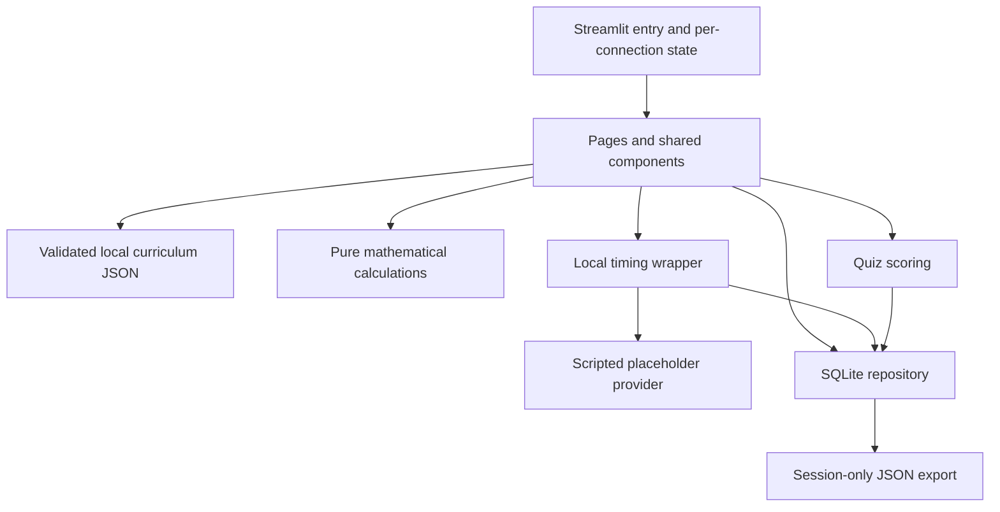

# Architecture and behavior

## Boundaries

`streamlit_app.py` wires the interface to the repository. `pages.py`, `components.py`, and `interactives.py` render supported Streamlit widgets without undocumented CSS selectors or unsafe HTML. All content comes from `data/curriculum.json`; no content generation runs at startup.

`math_logic.py` contains pure functions and raises understandable `ValueError`s for invalid numbers, probabilities, totals, population counts, and denominators. The UI supplies controlled values and explains invalid totals. It never silently normalizes probabilities. Floating-point equality uses an absolute tolerance of 1e-9; display values generally round to two decimals, retaining full calculation precision. Base-rate frequencies can be fractional expected counts and are labeled accordingly. There are no random simulations or synthetic results presented as observations.

`quiz.py` scores a question independently of UI state. `storage.py` manages short-lived SQLite connections and transactions, parameterized user data, foreign keys, and uniqueness constraints. SQL table names interpolated during reset come exclusively from a fixed source-code tuple. Connections are never globally cached or shared between sessions.

`coach.py` defines `CoachService` and the only concrete provider, `PlaceholderCoach`. `instrumentation.py` measures the synchronous local response call with `perf_counter`. No environment variable, secret, or input can select a live implementation. The manually written routing order is betting redirection, answer-substitution redirection, quiz/method hint, clarification, follow-up, fallback. Keyword routing is deliberately limited, not natural-language understanding.

## Session and database model

- `sessions`: random UUID, creation time, synthetic flag.
- `events`: module section visits, guided checks, interactive calculation actions, assistance, completion, conversation reset, sanitized service error codes. Section visits and completion use unique deduplication keys; explicit repeated interactive checks are separate actions.
- `runs`: session, module, quiz/practice kind, monotonically increasing attempt number.
- `assistance`: one entry per run/question, recorded when help is requested.
- `attempts`: immutable first submitted answer per run/question, correctness and assistance.
- `coach_metrics`: actual local duration, module, optional active question ID, route, placeholder provider, zero API requests/cost, NULL token counts. SQL constraints enforce the placeholder accounting contract.

Session UUIDs are held in `st.session_state`, not accepted from query strings or user controls. Every repository run operation checks session ownership. Exports join attempts through session-owned runs. Reset deletes only the current session, then clears state and starts a fresh UUID. Direct access to local SQLite files is an operator privilege; there is no authentication or separate OS-level user isolation.

Chat text is limited to 1,000 characters, 80 responses per session, at least 0.8 seconds between accepted submissions, and 20 visible exchanges per module. Text is kept only in server memory. A conversation reset clears the selected module's chat history but does not erase timing, assistance, or response limits. All-progress reset deletes that session's records and clears text. These limits bound ordinary prototype use; they are not a distributed anti-abuse system.

Startup initializes schema idempotently. There is no schema migration framework in this first version; a future schema change needs an explicit versioned migration or a documented prototype data reset.

## Exact scoring, completion, and retry contract

1. Core quizzes each have five ordered questions, difficulties 1, 1, 2, 2, 3. Each module has two additional authored practice questions.
2. An answer must be one of the specified options. No selection means no attempt is recorded.
3. The first submission for a run/question wins. Repeated submissions return the same stored attempt and never add credit.
4. A hint, the quiz's Ask a Question button, or sending a coach message with an unfinished active question marks that question assisted. Assistance is persisted before a response is produced. Failed response preparation does not remove the help mark.
5. Correct + no assistance = one unassisted-correct count. Correct + assistance = one assisted-correct count. Any wrong response = one incorrect count, retaining its assistance flag. Assisted success never earns unassisted credit. Incorrect answers still receive explanations.
6. Leaving and returning preserves the current run, submitted answers, and domain-backed unsubmitted quiz selection. Asking for help on the same module while its question is active also marks that question. The most recently active unfinished question is the coach context; a different module's chat is not attached to it.
7. Completion means all five distinct core questions submitted, regardless of correctness. It generates one completion event per run. Home progress counts modules with any completed quiz in the current session; starting a retry does not revoke prior completion.
8. A fresh quiz attempt is available after completion. It uses the same questions, starts with no selection or assistance, and retains previous attempts for export. The UI explicitly warns about prior exposure. There is no claimed pass threshold or validated mastery classification.
9. Practice is a separate finite run of two new authored questions. There is no endless-generation button. After both are used, explanations remain available and the UI reports exhaustion. An explicit all-progress reset begins a new session and makes all material available again.
10. Results cards are per current run; the measurements page aggregates all attempts including retries and practice. Neither measure demonstrates long-term learning.

## Measurement contract

Timing begins immediately before `respond()` and ends immediately after it. Database write time, Streamlit reruns, rendering, and network transport to the browser are excluded. No-response averages are displayed as unavailable, not zero. All coach metrics use `provider_mode=placeholder`, `api_requests=0`, `api_cost_usd=0`, and null input/output token counts.

The total project API/MCP budget is $20, with $5 initially assigned to prototyping. This application's runtime spends none of that model API budget. Future tracking must include evaluation and model-as-judge calls, not just learner conversations. No Week 3 baseline, improvement history, research interview, or role-play transcript has been invented.

## Accessibility choices

Use native labels, radio groups, buttons, expanders, Streamlit theme configuration, and text alongside charts. Formulas have expandable symbol definitions. The compact base-rate formula uses π, s, and f with explicit mappings to prevalence and conditional clue rates. Column layouts are limited and Streamlit stacks them on small screens. Whole lesson sections can be navigated directly; there is no timer-driven movement or surprise focus change.

PRD pop-up glossaries are implemented as keyboard-operable expanders. Narration synchronization, glowing symbols, voice tone/speed, and automatic scrolling depend on absent recordings or fragile custom browser code; readable scripts and user-selected sections are the concrete accessible alternative. See the limitations document for the remaining validation scope.
