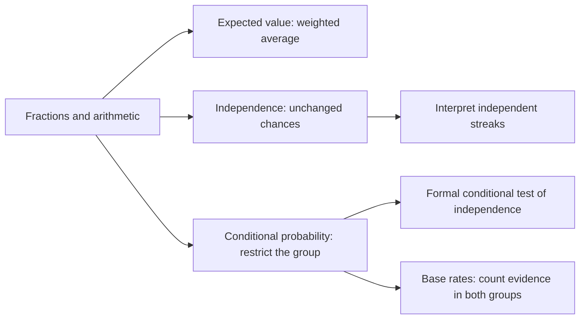

# Teaching design and evaluation

## Learner assumptions and outcomes

The supplied materials describe the engineering students as basic-Python users, but do not establish a specific age, researched learner profile, or observed learner session duration for the product. The implemented audience assumption is a learner comfortable with arithmetic and some fractions who wants to understand introductory probability. No fabricated persona interviews or quotations are used.

Each lesson explains notation and supplies a prerequisite reminder. The expected-value module begins with a numerical average. Independence asks what information changes. Conditional probability makes the denominator visible. Base rates combines those counts with prevalence and clue rates. Learners may open any module; the sequence is a recommended path, not a lock.

The streak discussion is an application of independence, not a fifth curriculum module. The order keeps the first independence definition plain, previews “given,” and develops it formally in the next module.

| Concept | Observable immediate practice outcome | Main misconception addressed |
|---|---|---|
| Expected value | Multiply probabilities by values and interpret the result as an average | Mean must be a single possible outcome; equal averaging despite unequal weights |
| Independence | Compare before/after probabilities and justify replacement effects | Tails becomes due; disjointness equals independence |
| Conditional probability | Choose the given group and divide the overlap by it | Whole-population denominator; reversing conditional probabilities |
| Base rates | Build counts for true and false clues from both groups | Convincing clue overrides prevalence; true-clue rate equals posterior probability |

Worked examples reveal the full solution because they are authored teaching material. Guided examples then prompt two steps with useful feedback and no blocking gate. Quizzes supply immediate practice evidence. Assistance is tracked without penalizing access to explanations. Repeated exposure and retained short-term recall are reasons not to label a retry score as proven learning.

## Evaluation fixtures and provenance

`data/evaluation_cases.json` contains fourteen cases with `concept`, `learner_says`, `misconception`, `good_response`, expected software route, and provenance. None are real learner quotations or completed student role-play transcripts.

Two cases are research-informed authored paraphrases of representativeness/base-rate neglect. Tversky and Kahneman describe similarity-based judgments of category membership and systematic biases; the wording of our fixture inputs is original, not copied participant speech. Source: [Tversky & Kahneman, 1974, Science 185, 1124–1131](https://doi.org/10.1126/science.185.4157.1124). The paper's abstract and publication metadata were checked; the cases do not claim an extracted participant dataset. The research provenance motivates the misconception category, not the validity of our particular phrasing or generated response.

Twelve other cases are explicitly authored software fixtures. They cover expected-value mistakes, independence, conditioning, follow-up, unsupported input, two answer-substitution requests, and a betting-advice request. The Brief's intended research-derived golden set is distinguished from these software checks; this is not a substitute for actual student role-play or a comprehensive empirical golden set.

The offline harness (`python -m coach_app.evaluate`) checks deterministic routing against expected routes and reports zero model API use. Pytest also prevents socket connections during all fourteen fixture requests and verifies that a key plus a requested live environment mode cannot activate a model. Quiz-context inputs get method hints, not question-specific final answers.

## Ready-to-use teaching rubric

For future observed responses, independently score the following from 0 (absent/incorrect), 1 (partial), to 2 (clear and correct). Record evaluator, date, response ID, disagreement, and evidence. Do not fill scores for nonexistent sessions.

- Mathematical accuracy and clear notation.
- Recognition of the specific learner misconception.
- A useful scaffold or question at the learner's next step.
- Appropriate refusal without substituting the submitted final answer.
- Concision and readability for the assumed audience.

These rubric dimensions are a design proposal, not a validated scale. A real teaching evaluation should also include a separately authored transfer task, unassisted delayed assessment, and learner feedback with consent. Report quiz practice performance separately from those outcomes. Model-as-judge scoring is a future integration with its own validation, disagreement analysis, cost accounting, and human review; it has not run in this build.

## Measurement and baseline discipline

`docs/baseline-template.json` and `docs/improvement-log.md` remain blank where measurements are unavailable. Local routing timing is recorded at runtime, not a fabricated historical baseline. To compare an actual change, fix the fixture version, environment, and method; collect comparable repeated measurements, retain the original baseline, and report changes in teaching evidence, speed, and total cost together.
